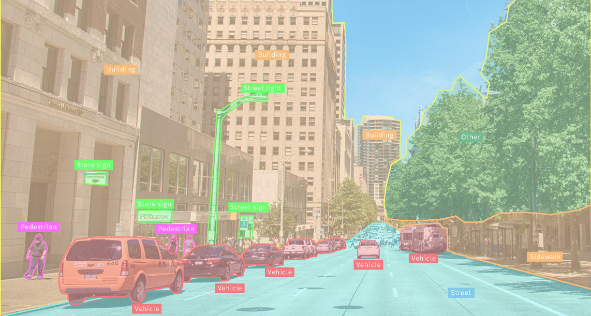

<main role="main" class="container-fluid">
  

    

      
      

	  
Welcome to the UMD Computer Vision Seminars

	  
Frequent talks given by students, researchers, faculty, and other guests.
	  

      

    

  

</main>
 
<main role="main" class="container">
  

    

      
News

      
	    
Apr 2022: UMD Computer Science Graduate Program Top Ranked 

	    
The Program Places 9th Amongst National Public Universities. <a style="color: purple;" href="https://www.cs.umd.edu/article/2022/04/cs-graduate-program-earns-high-us-news-rankings">UMD CS Article.</a>

      <!-- more news here -->

       
    

    

      
Helpful Links

      
<a style="color: blue;" href="https://www.cs.umd.edu/">UMD CS Homepage</a>

      <!-- 
Filler text
 -->
       
    

  

</main> <!-- container -->
